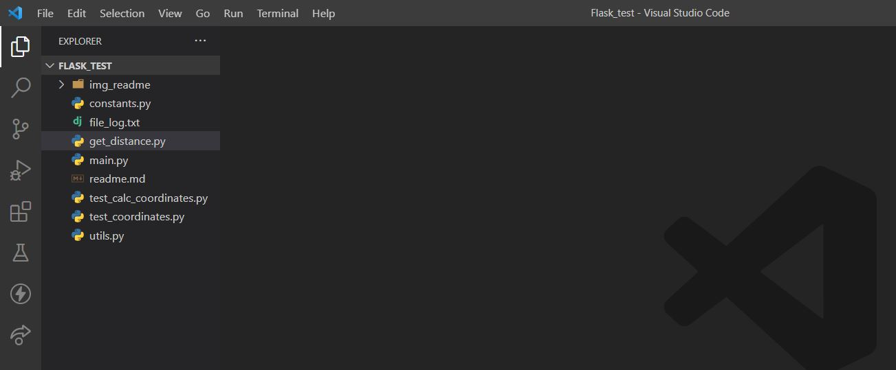
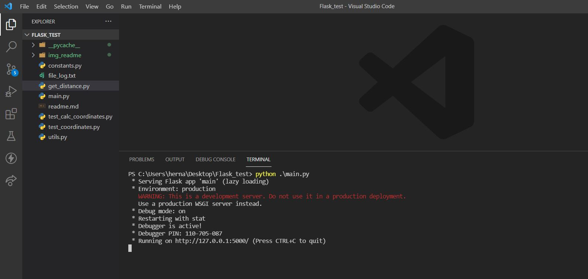
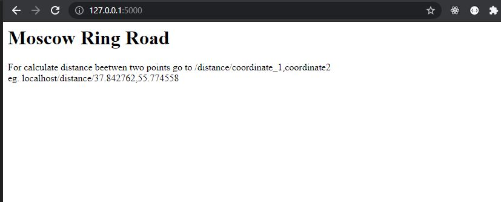
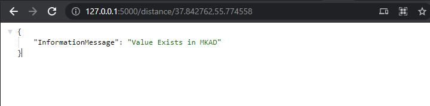
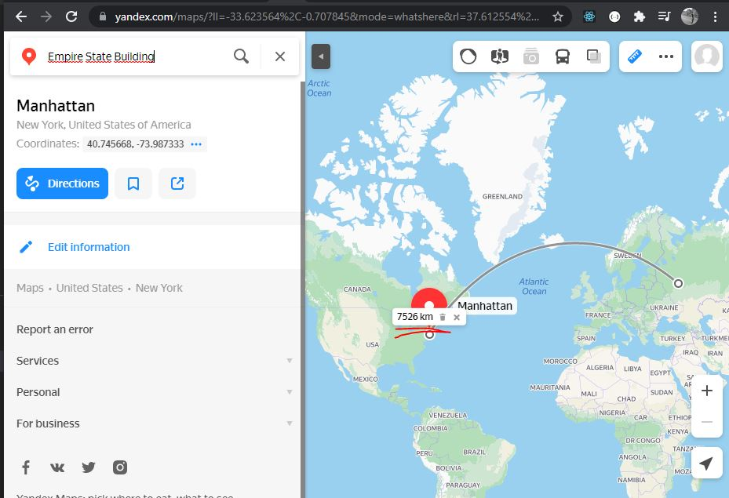
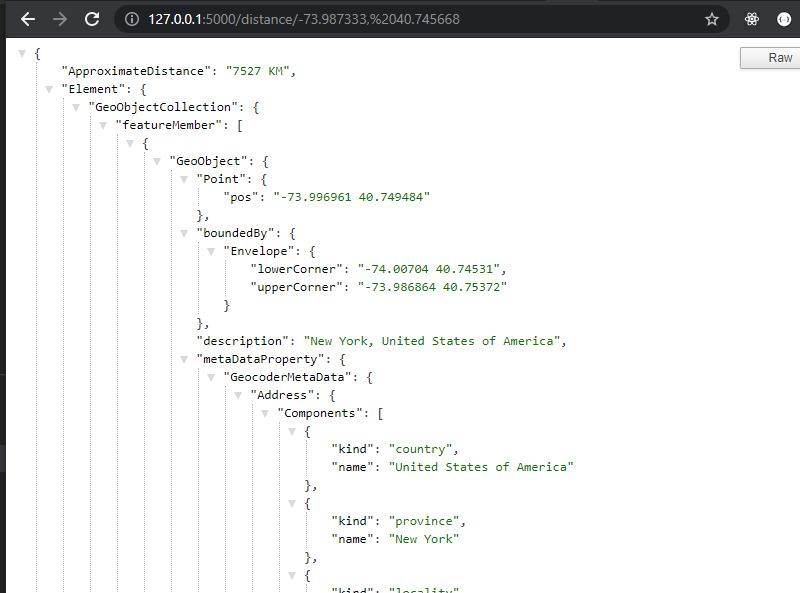
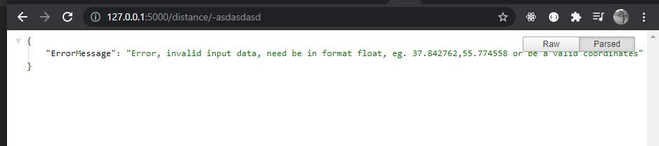
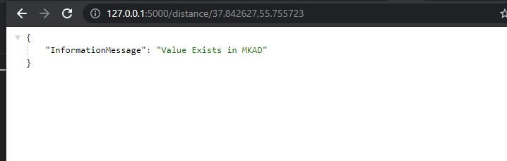

# Operation Manual 

``` 
========================================
	author : Edgar Hernandez
========================================

########################################
#		Important Note                #
########################################
The coordinates must be entered in long, lat form to coincide with the coordinates of the road ring, since they come backwards. I also want to comment that the distance can vary a bit since when making the request to the Api, it returns one or more values, if the exact value of the coordinate is not found in the result of the api, the program will take the first or only existing element returned by the api
```


## Requeriments

* Flask
* Python 3.8+
* Geopy
* Pytest

## Install Requeriments

Open the project in your Pycharm or Visual studio code



Open the terminal from your IDE o from your system and paste the following commands

```python
pip install geopy
pip install Flask

```

## Open Aplication


Now you must have everything you need to run the application, in the same terminal write python. \ Main.py this will run the application.

You should see a message similar to the following, you can view the page if you copy and paste the link in your browser, or if you click on it



The top of the page is shown below



To access the calculation of distances between two points we have to write **/distance/[coordinates]** where the coordinates must be passed as floating numbers like a **37.842762,55.774558**



Execution example, we will take the distance that exists between the road ring and the empire state, first we will measure it with yandex map and then we will check with the application



**Important note** In the yandex map the coordinates are sent in the form of latitude, longitude but in our application they will be sent in the form of longitude, latitude. For example if the Empire State coordinates are **40.745668, -73.987333** we will send them in the following format **- 73.987333, 40.745668**



### The result may vary a bit since a rounding was done


#### Only coordinates are accepted, so if you try to write any name or random integers it will throw an error and write it in the log




#### If the coordinates already exist within mkad, it will be written to the log file and the distance will not be calculated.


